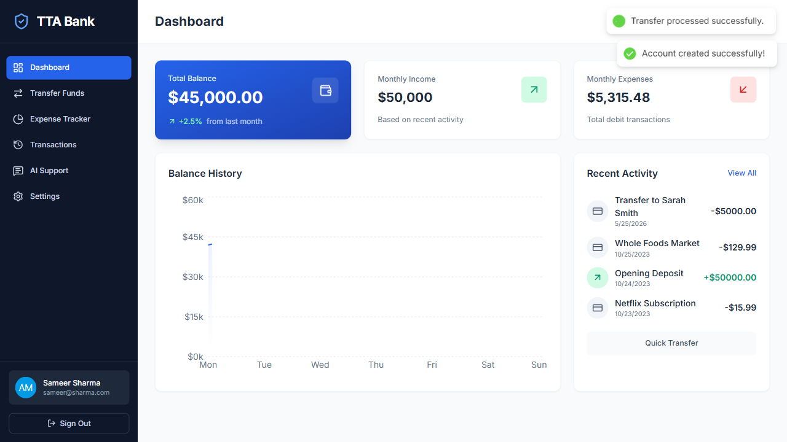

# 🏦 TTA Bank Amount Transfer Test Case

This folder contains the end-to-end automation test for the **TTA Bank Digital** application, specifically verifying the sign-up, money transfer, and balance calculation logic.

## 📄 Test File
* **File name**: `04_TTA_Bank_Amt_Trns.spec.ts`
* **Path**: `tests/Projects/04_TTA_Bank/04_TTA_Bank_Amt_Trns.spec.ts`

## ⚙️ Test Logic & Flow

1. **Access TTA Bank application**: Navigate to the bank digital login/landing page.
2. **User Sign Up:**
   * Enter User Name (`Sameer Sharma`), Email (`sameer@sharma.com`), and Password (`Test1234`).
   * Assert that the user is navigated and the dashboard displays correctly.
3. **Verify Initial State:**
   * Get and verify the initial dashboard title and balance details.
4. **Initiate Transfer:**
   * Click **Transfer Funds** button.
   * Input the Transfer Amount (`$5000`) and add comments (`Rent`).
   * Confirm the transaction.
5. **Post-Transfer Verification:**
   * Navigate back to the main dashboard.
   * Verify that the total balance is updated and equals exactly **`$45,000.00`**.

## 📊 Test Report Screenshot

Below is the screenshot captured during the execution of the amount transfer test from the TTA Custom HTML Report:



## 🚀 How to Run the Test

To run this specific bank transfer test, execute:
```bash
npx playwright test tests/Projects/04_TTA_Bank/04_TTA_Bank_Amt_Trns.spec.ts
```

*The execution will automatically run the custom HTML and markdown reporter, recording the video and screenshots as configured in `playwright.config.ts`.*
