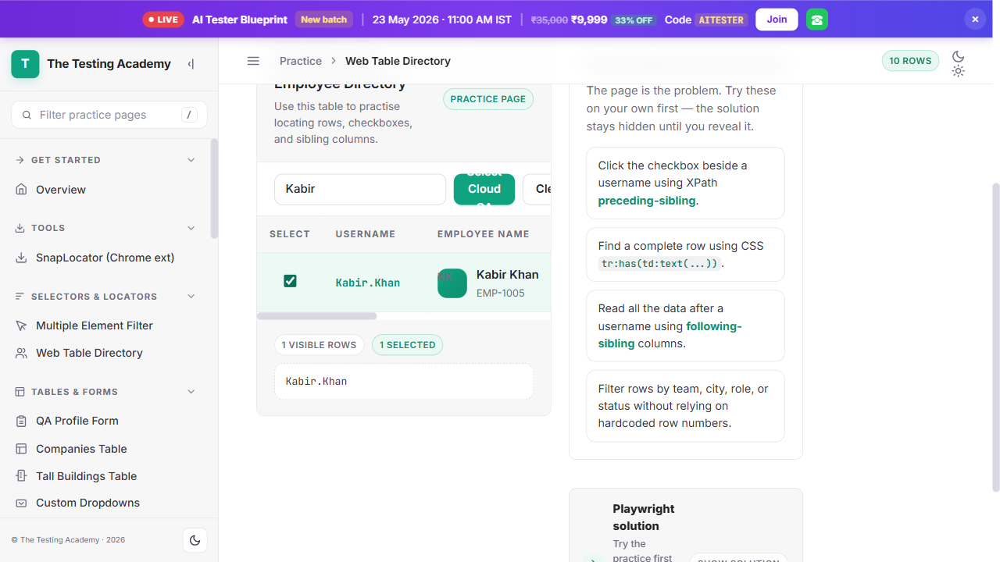

# 🔍 Search, Select, and Verify Employee in Web Table

This directory contains the end-to-end automation test case specifically verifying search and checkbox selection capabilities in a dynamic employee management web table.

## 📄 Test File
* **File name**: `06_Search_Web_Table.spec.ts`
* **Path**: `tests/Projects/06_Search_Employee_Web_Table/06_Search_Web_Table.spec.ts`

## ⚙️ Test Logic & Flow

1. **Access the Web Table Application**: Navigates to the web table testing sandbox at `https://app.thetestingacademy.com/playwright/webtable`.
2. **Search Employee:**
   * Locate the search input using the label `"Search employee table"`.
   * Type the employee name query (`"Kabir"`) into the search field to filter the web table.
3. **Select Employee Checkbox:**
   * Locate the specific table row (`tr`) matching the employee's name (`"Kabir"`).
   * Find and check the checkbox input within that filtered row.
4. **Verification:**
   * Assert that the selection output element (`.selected-output`) updates and contains the selected employee name (`"Kabir"`).

## 📊 Test Report Screenshot

Below is the screenshot captured during the successful execution of the search, selection, and verification steps in the web table:



## 🚀 How to Run the Test

To execute this specific search and web table test suite, run:
```bash
npx playwright test tests/Projects/06_Search_Employee_Web_Table/06_Search_Web_Table.spec.ts
```

*This will automatically capture screenshots, record videos, and generate an interactive Custom TTA HTML & Markdown Report as configured in your framework.*
