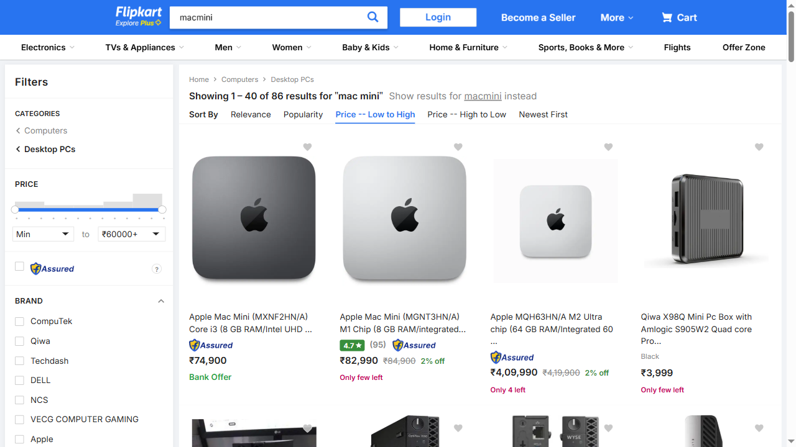
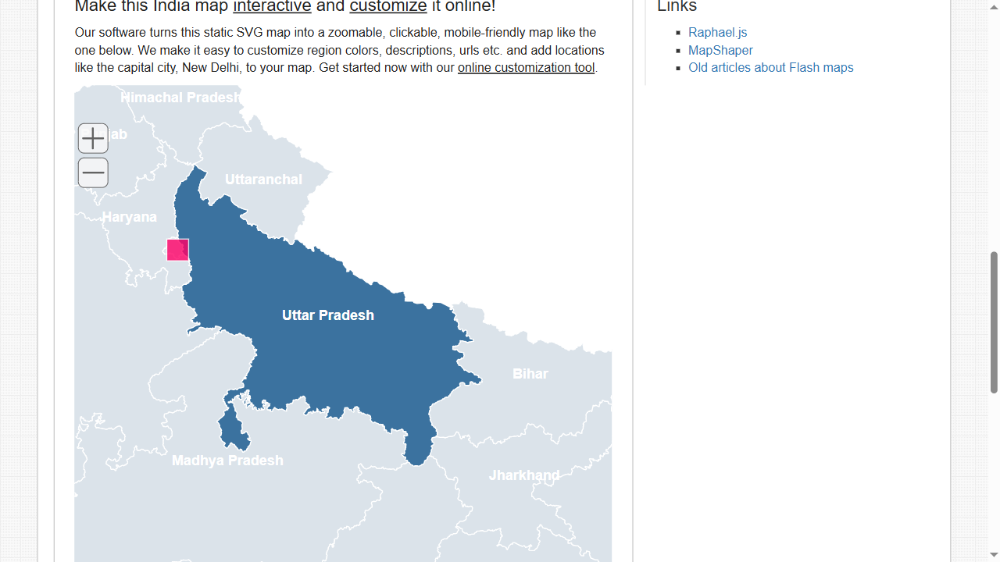

# 📦 SVG Flipkart Search & Indian States Map Automation

This directory contains advanced E2E automation suites verifying dynamic search sorting workflows on Flipkart and interactive SVG map path processing for the states of India.

---

## 📁 Projects & Test Specifications

### 1. Flipkart Search & Sort (`08_Flipkart_search.spec.ts`)
* **Goal**: Search for a product, extract its initial available details, apply the low-to-high price filter, and identify the lowest priced item.
* **Flow**:
  1. Access the Flipkart product search catalog.
  2. Input `"macmini"` into the search bar and click the search icon.
  3. Fetch the first product's name and price and log it under **"The first available product is"**.
  4. Click the filter option to sort the listings by **"Price -- Low to High"**.
  5. Fetch the sorted products and output the lowest price listing.
* **Test Video & Screenshot**:
  * 
  * [🎥 Watch Flipkart Search Video Recording](./flipkart_video.webm)

### 2. SVG Indian States Map Interaction (`08_India_Map.spec.ts`)
* **Goal**: Extract state information from a dynamic SVG container representing the map of India and interact with specific regions.
* **Flow**:
  1. Access the country map SVG template directory.
  2. Locate all `<path>` elements representing the Indian states (`#admin1_map_inner>svg>path`).
  3. Loop through all 36 state SVG paths, extract their class attribute names, slice the state code (e.g., `MP`, `OR`, `UP`), and log them in real-time.
  4. Conditionally check if the current state class matches Uttar Pradesh (`sm_state sm_state_INUP`), log `"Found Uttar Pradesh! Clicking..."`, and perform a click action.
* **Test Video & Screenshot**:
  * 
  * [🎥 Watch India Map SVG Video Recording](./india_map_video.webm)

---

## 🚀 How to Run the Test Suites

To execute both test suites in headless or headed browsers, run:
```bash
npx playwright test tests/Projects/08_SVG_Flipkart_India_Map/
```

To run a single spec file, e.g., the SVG India Map script:
```bash
npx playwright test tests/Projects/08_SVG_Flipkart_India_Map/08_India_Map.spec.ts
```
